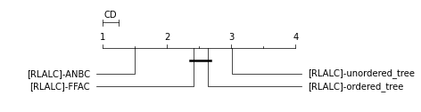

# OLOUT - Optimal leaf ordering of phylogenetic trees
##### Author: Gojko Hajdukovic, 11.2021

Table of contents:
1. [Project description](#description)
2. [Goals](#goals)
3. [Data](#data)
4. [Data transformation pipeline](#datatransform)
5. [Package setup](#setup)
6. [Reproduction of experiments](#experiment)


<a name="description"></a>
## Project description
This project includes all the data and the code necessary for the reproduction of the results described
and generated while working on the Master Thesis with title "Optimal leaf ordering of phylogenetic trees" at the Faculty of Computer and Information Science, University of Ljubljana.

<a name="goals"></a>
## Goals
This Thesis focuses on exploring and evaluating approaches for inducing optimal linear leaf ordering,
generalized for phylogenetic `k-ary` trees, and the visual representation of such optimally ordered phylogenetic trees in 2-dimensional space.
For this purpose, we divide the problem into two subproblems:
- We aim to explore and evaluate a selected algorithm that induces a linear leaf ordering for phylogenetic trees - `KOLO`, introduced in [Bar-Joseph et al.](https://academic.oup.com/bioinformatics/article/19/9/1070/284974?login=true).
- We aim to explore and experimentally evaluate the Radial Layout algorithm introduced in 
  `Bachmaier et al.` for visualizing phylogenetic trees in 2-dimensional space, which takes into account the induced linear leaf order
    - We aim to present an evaluation metric to measure the quality of the layout in 2-dimensional space.
    - We aim to present and explore an alternative heuristic for the Radial Layout that takes into account the specifics of phylogenetic trees.
    - We aim to present two postprocessing algorithms applied to the Radial Layout so that the quality of the visualization layout is improved.

<a name="data"></a>
## Data
To achieve the above described goals and to test and evaluate existing and newly presented algorithms
we collected the publicly available data from the online phylogenetic tree database, [TreeBase](https://treebase.org/treebase-web/home.html).
We collected 1952 available publication data in Nexus format out of which we processed 369 phylogenetic
trees that follow the standard Newick format notation. The source data collected in Nexus format is available in the [source data](data/source_data) directory. 

<a name="datatransform"></a>
## Data transformation pipeline
As described in the Thesis, publicly available phylogenetic databases
usually store the phylogenetic trees as Newick Formatted strings without providing the original distance matrix neither the algorithm used for the construction of the phylogenetic trees. 
The algorithms that infer the optimal linear leaf ordering base their procedure on the evolutionary distance between leaf nodes,
therefore they need to reconstruct the distance matrix first.
To tackle the above described problems, as a first contribution of the thesis we construct a
data transformation pipeline that extracts, transforms and loads the raw phylogenetic data available from the database, [TreeBase](https://treebase.org/treebase-web/home.html).

The transformation pipeline that constructs the final transformed dataset is stored in [preprocess](olout/utils/preprocess.py) python module.
The pipeline consists of several steps:
- Parses the raw Nexus files.
- Extracts the phylogenetic tree in the Newick format along with the node-label mapping.
- Extracts the URL of the publication data available at [TreeBase](https://treebase.org/treebase-web/home.html)
- Reconstructs original distance matrix.
- Stores the extracted and constructed data as `JSON` formatted files in the [final_data](data/final_data) directory.

All the data for the 369 processed phylogenetic trees that follow the standard Newick format notation is available in the [final_data](data/final_data) directory.
Each processed publication `JSON` file in the `final dataset` consists of the following fields:
  ```
  {
    "NEXUS_FILE_URL": "...",
    "NEWICK_TREE": "...",
    "DISTANCE_MATRIX": [[]],
    "NODE_MAPPING" : [[]]
  }
```


<a name="setup"></a>
## Setup
  ### Package installation 
These instructions assume that the user has cloned the repo and is in repo's root.
```shell script
git clone https://github.com/ghajduk3/OLOUT.git && cd OLOUT
```

In order to set-up virtual environment issue:
```shell script
python -m venv venv
#Activate the environment
source venv/bin/activate
```
To install project related dependencies issue:
```shell script
pip install -r requirements.txt
```
To install the project, in the root of the project issue:
```shell script
python setup.py install 
```

<a name="experiment"></a>
## Experiments reproduction 
To reproduce the experiments described in the Thesis we created an evaluation pipeline. As described in the Thesis
an evaluation suite consists out of four different layouts for both available heuristics `LEAF COUNT` and `BRANCH LENGTH`:

- Radial Layout of the unordered phylogenetic tree
- Radial Layout of the optimally ordered phylogenetic tree with KOLO
- ANBC algorithm node corrections to the Radial Layout
- FFAC algorithm node corrections to the Radial Layout 

Before running the experiments make sure that the dataset is constructed and located in [final_data](data/final_data). **Note** Final dataset is preparede and ready in this repository.
To run the experiments issue:
```python
from olout.utils import  evaluation_pipeline, constants

if __name__ == "__main__":
        # Radial Layout using LEAF_COUNT as the heuristic (RLALC algorithm)
        evaluation_pipeline.run_evaluation_suites(radial_visualization_method=constants.RADIAL_LAYOUT_LEAF_COUNT, file_name='data_leaf_count')
        # Radial Layout using BRANCH_LENGTH as the heuristic (RLABL algorithm)
        evaluation_pipeline.run_evaluation_suites(radial_visualization_method=constants.RADIAL_LAYOUT_BRANCH_LENGTH, file_name='data_branch_length')
```

After the experiments are successfully completed the evaluation data will be created in the [evaluations](data/evaluations) directory.
For each phylogenetic tree from the collected dataset a new evaluation directory will be created consisting of two `json` files, `data_branch_length.json` for the layouts based on the `RLABL` algorithm
and `data_leaf_count.json` for the layouts based on the `RLALC` algorithm. 

Each evaluation file consists from the following fields:
  - number_nodes
  - number_leaves 
  - optimal_leaf_ordering_kolo 
  - execution_time_kolo
  - radial_layout_points_unordered_tree
  - radial_layout_points_ordered_tree 
  - radial_layout_points_ordered_tree_FFAC
  - radial_layout_points_ordered_tree_ANBC 
  - radial_layout_unordered_tree_stress 
  - radial_layout_ordered_tree_stress 
  - radial_layout_ordered_tree_FFAC_stress 
  - radial_layout_ordered_tree_ANBC_stress 
  - execution_time_radial_layout 
  - execution_time_ANBC 
  - execution_time_FFAC 
  - FFAC_best_correction_factor

After obtaining the experimental evaluation results for each phylogenetic tree from the collected dataset, issue the following script to join the data necessary for further evaluation results:
```python
from olout.utils import result_processing
import Orange
import matplotlib.pyplot as plt

if __name__ == '__main__':
    # Joins the evaluation results // creates joined in data/evaluation_data_joined.csv
    result_processing.join_evaluation_results()
    # Averages the ranks of all algorithms for both Radial Layout heuristics
    # This is neccessary for calculating the Critical Difference graph
    col_name, col_avg, num_experiments = result_processing.evaluate_all_visualization_methods()
    
    # Critical Difference graph 
    result_processing.construct_CD_graph(col_name, col_avg, num_experiments)
```
The critical difference graphs should be generated as:
 - CD graph for both heuristic methods (RLALC and RLABL)


 
 - CD graph for RLALC algorithm




## Usage 

## Examples

